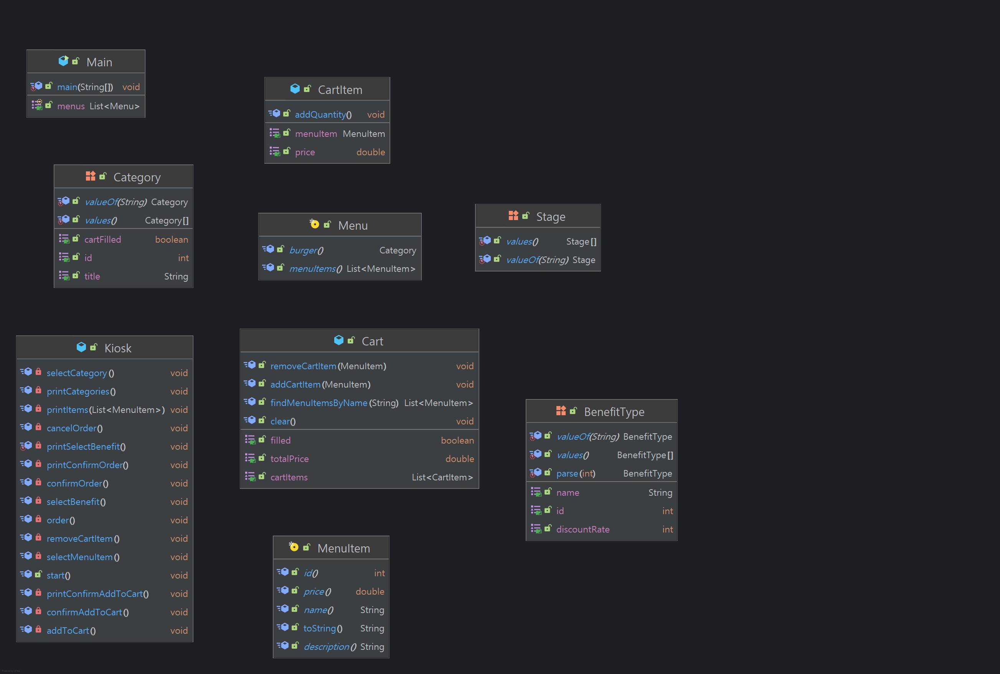

# 프로젝트 소개

클래스의 개념을 이해하고, 객체 지향 설계를 활용해 키오스크를 구현하기

---

# 개발 환경

- Windows 11
- Eclipse Temurin JDK 17
- IntelliJ Ultimate

---

# 프로젝트 구조

📁 프로젝트 폴더 구조
```
📂 com
└── 📂 example
    ├── 📂 constant
    │   ├── 📄 BenefitType
    │   ├── 📄 Category
    │   └── 📄 Stage
    ├── 📂 domain
    │   ├── 📄 CartItem
    │   ├── 📄 Menu
    │   └── 📄 MenuItem
    └── 📂 service
        ├── 📄 Cart
        ├── 📄 Kiosk
        └── 📄 Main
```

🔹 폴더 설명
- constant/ : 상수(enum) 관련 클래스
- domain/   : 주요 도메인 모델
- service/  : 서비스 로직 관련 클래스

---

# 요구사항 정의

## 요구사항 정의서
| 기능명        | 상세설명                                                                                                                                                                                                               | 에외 처리                                                                                                            |
|------------|--------------------------------------------------------------------------------------------------------------------------------------------------------------------------------------------------------------------|------------------------------------------------------------------------------------------------------------------|
| 메뉴 카테고리 선택 | - 메뉴의 카테고리 및 종료 항목을 보여준다.<br/>- 장바구니가 채워져 있을 경우 주문, 주문 취소, 장바구니 비우기 항목을 보여준다.<br/>- 숫자를 통해 명령을 입력받는다.<br/>- 메뉴를 선택할 경우, 메뉴 선택 기능으로 넘어간다.<br/>- 종료를 선택할 경우, 프로그램이 종료된다.<br/>- 장바구니 비우기를 선택한 경우, 장바구니 비우기 기능으로 넘어간다. | - 숫자가 아닌 문자가 입력될 경우, 오류 메시지를 띄우고 다시 입력 받는다.<br/>- 장바구니가 비어있는데 주문, 주문 취소, 장바구니 비우기 항목을 선택시 오류 메시지를 띄우고 다시 입력 받는다. | 
| 메뉴 선택      | - 메뉴 및 뒤로가기 항목을 보여준다.<br/>- 숫자를 통해 명령을 입력받는다.<br/>- 메뉴를 선택할 경우, 장바구니에 추가할지 여부를 정하는 기능으로 넘어간다.<br/>- 뒤로가기를 선택할 경우, 메뉴 카테고리 선택 기능으로 넘어간다.                                                                            | - 숫자가 아닌 문자가 입력될 경우, 오류 메시지를 띄우고 다시 입력 받는다.                                                                      
| 장바구니 추가    | - 선택된 메뉴를 장바구니에 추가할 것인지 여부를 입력받는다.<br/>- 추가를 선택할 경우, 장바구니에 추가하고 메뉴 카테고리 선택 기능으로 넘어간다.<br/>- 취소를 선택할 경우, 메뉴 카테고리 선택 기능으로 넘어간다.                                                                                      | - 숫자가 아닌 문자가 입력될 경우, 오류 메시지를 띄우고 다시 입력 받는다.                                                                      
| 장바구니 비우기   | - 장바구니에서 제거하고 싶은 메뉴의 이름 일부를 입력받는다.<br/>- 매칭된 메뉴들과 취소 항목을 출력한다.<br/>- 메뉴를 선택할 경우, 해당 메뉴를 장바구니에서 제거 후 카테고리 선택 기능으로 넘어간다.<br/>- 취소를 선택할 경우, 카테고리 선택 기능으로 넘어간다.                                                        | - 숫자가 아닌 문자가 입력될 경우, 오류 메시지를 띄우고 다시 입력 받는다.                                                                      
| 주문         | - 장바구니 목록과 총 가격을 출력하고 주문 여부를 입력받는다.<br/>- 주문을 선택할 경우, 할인 혜택을 선택하는 기능으로 넘어간다.<br/>- 취소를 누를 경우, 주문 취소 기능으로 넘어간다.                                                                                                     | - 숫자가 아닌 문자가 입력될 경우, 오류 메시지를 띄우고 다시 입력 받는다.                                                                      
| 주문 취소      | - 장바구니를 비우고 카테고리 선택 기능으로 넘어간다.                                                                                                                                                                                     |
| 할인 적용      | - 적용 가능한 할인 항목과 할인 퍼센트를 출력하고 할인 혜택을 입력받는다.<br/>- 할인을 적용해 최종 가격을 출력하고 카테고리 선택 기능으로 넘어간다.                                                                                                                            | - 숫자가 아닌 문자가 입력될 경우, 오류 메시지를 띄우고 다시 입력 받는다.                                                                      |

## 사용자 인터페이스
콘솔 기반의 사용자 인터페이스를 사용한다.

---

# 설계

## 클래스 다이어그램



---

# 깃 컨벤션

- tag: subject
- body
- footer

## tag
feat: 새로운 기능 추가  
fix: 버그 수정  
docs: 문서 수정  
style: 코드 포맷팅, 세미콜론 누락, 코드 변경이 없는 경우  
refactor: 코드 리팩토링  
test: 테스트 코드, 리팩토링 테스트 코드 추가  
chore: 빌드 업무 수정, 패키지 매니저 수정  

---

# 트러블 슈팅
[url](https://dungbik.github.io/p/nb-til-14/)